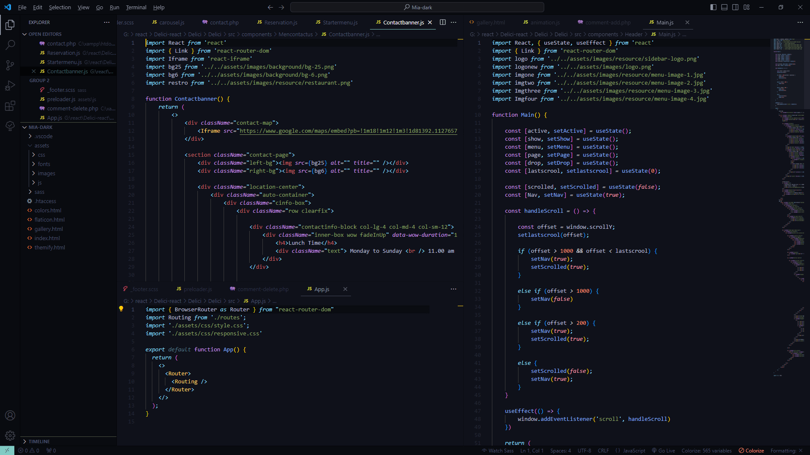
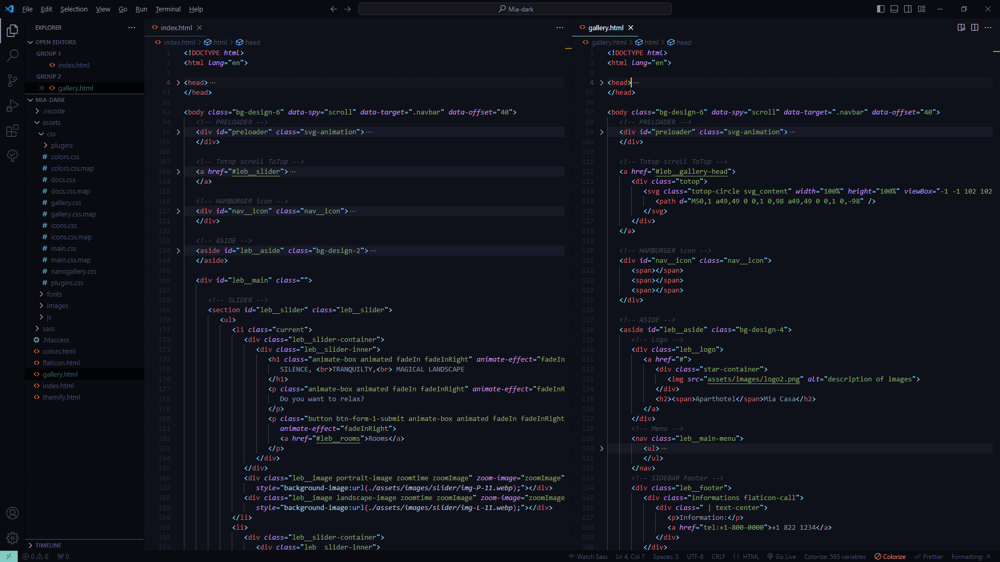

# Individual Theme for VS Code

   Simply install the `individual-theme-0.0.12.vsix` file, and add a burst of energy to your Visual Studio Code setup.
   This extension provides a highly contrasting theme with vibrant colors, designed to enhance code readability and focus during development.

---
## Preview

#### REACT

#### HTML

#### CSS SASS

#### JS

#### PHP

## Installation Guide
### Prerequisites
   Ensure that you have Visual Studio Code installed on your system.

### Step 1: Download the Theme
   1. Go to the Releases section of this repository.
   2. Download the latest version of the theme (`individual-theme-0.0.12.vsix`).

### Step 2: Install the Theme in Visual Studio Code
   1. Open Visual Studio Code.
   2. Go to the Extensions view by clicking on the Extensions icon in the Activity Bar on the side of the window or by pressing (`Ctrl+Shift+X` or `Cmd+Shift+X`).
   3. In the Extensions view, click on the three-dot menu at the top-right corner.
   4. Select "Install from VSIX..." from the dropdown menu.
   5. Navigate to the location where you downloaded the individual-theme-0.0.12.vsix file.
   6. Select the file and click "Open."

### Step 3: Activate the Theme
   1. After installation, go to File > Preferences > Color Theme (or press '`Ctrl+K` or `Ctrl+T`).
   2. Select "Individual Theme" from the list.

### Step 4: Enjoy Your Customized VS Code Experience!
   If you encounter any issues, feel free to open an issue on this repository.

## Copyright and License

   Copyright 2024 Lebryere. Code released under the 