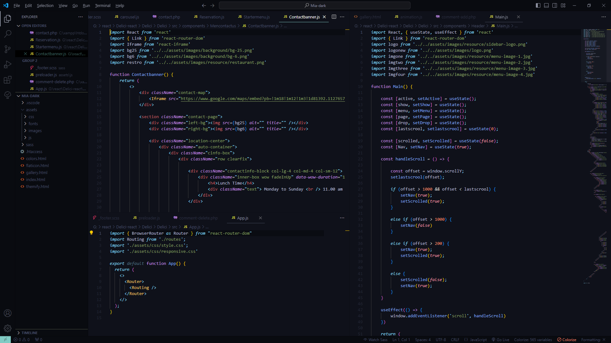

## VSCode Extension Quickstart

---
## Preview

#### REACT


#### HTML


#### CSS SASS


#### JS


#### PHP


### Extension Description
   This extension provides a highly contrasting theme with vibrant colors, designed to enhance code readability and focus during development.

### Download the Theme
   1. Go to the Releases section of this repository.
   2. Download the latest version of the theme (`individual-theme-0.0.12.vsix`).

### Installation
   1. Open Visual Studio Code.
   2. Navigate to the Extensions view (`Ctrl+Shift+X` or `Cmd+Shift+X`).
   3. Search for the extension in the search bar.
   4. Click the "Install" button.

### Usage
   Activate the extension from the Command Palette (`Ctrl+Shift+P` or `Cmd+Shift +P`) and search for the extension name.

### Configuration
   - Extension configuration settings can be found in the `settings.json` file. For example:
   ```json
   {
      "myExtension.someSetting": true
   }
   ```

### Troubleshooting
   If you encounter issues, try reinstalling the extension or check the documentation for common problems.

### Support and Contact
   Submit questions and bug reports to the issues page.

### Copyright and License

   Copyright 2024 Lebryere. Code released under the [](https://raw.githubusercontent.com/LeBryere/Hello-balcsi/master/LICENCE)